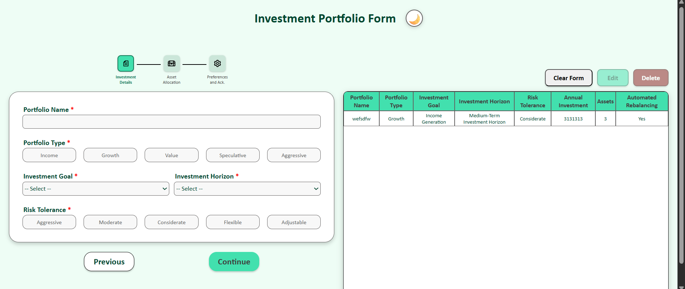
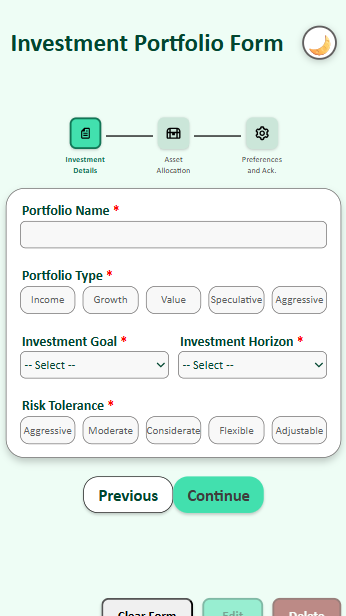
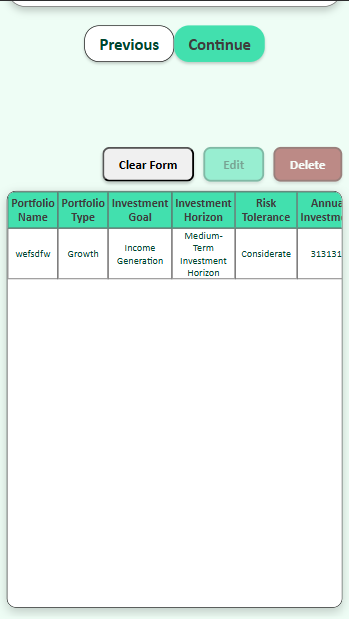
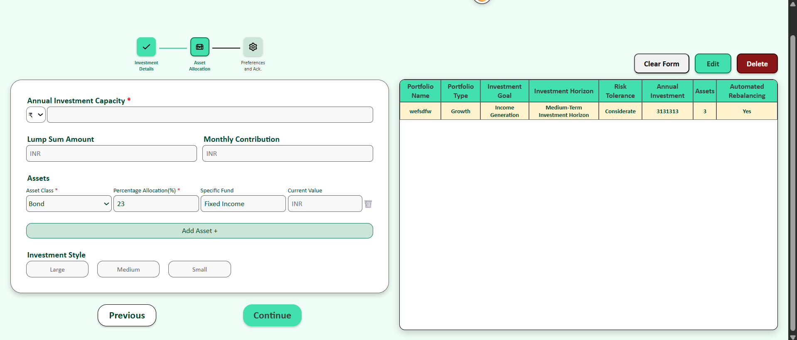
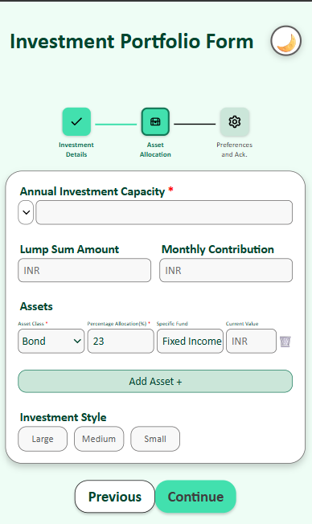
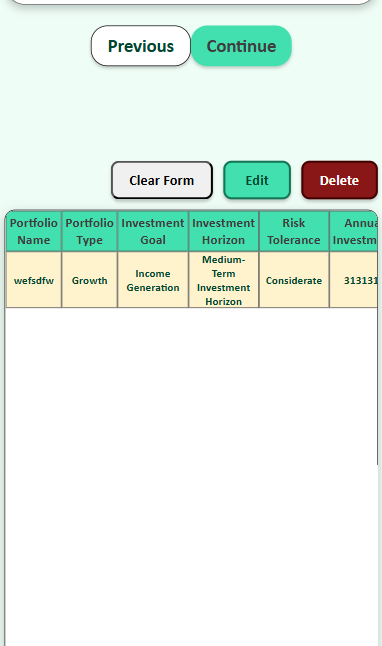
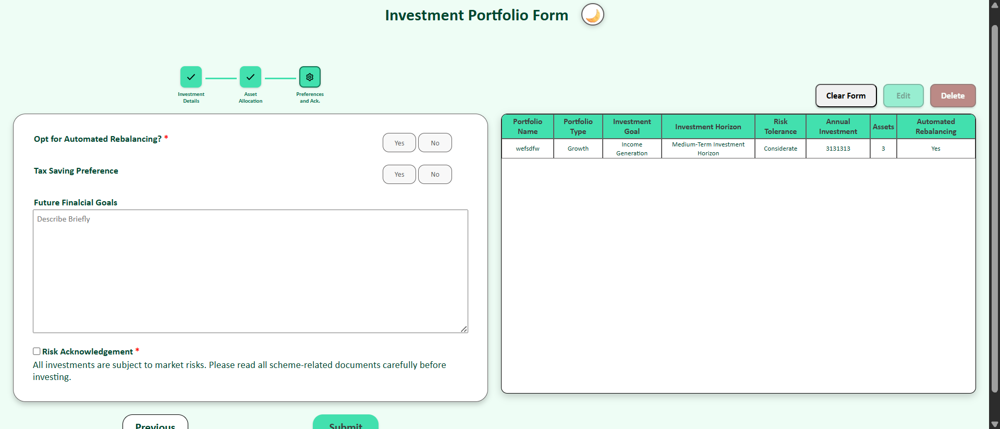
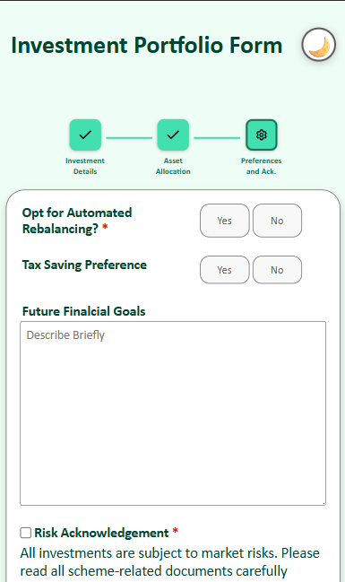
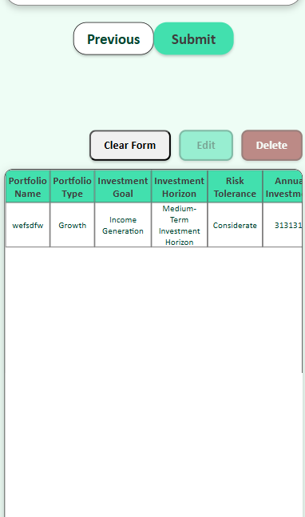

# Investment-Portfolio-Form

## This form consists of three parts

### Investment Details

The user inputs the the following in investment details part:

1. Portfolio Name (Required Text Field)
2. Portfolio Type (Required Radio)
3. Investment Goal (Required dropdown)
4. Investment Horizon (Required dropdown)
5. Risk Tolerance (Required Radio)





### Asset Allocation

The user inputs the the following in asset allocation part:

1. Annual Investment Capacity (Required Input)
2. Lump Sum Amount (Optional Input)
3. Monthly Contribution (Optional Input)
4. Asset Information : (1 asset required, multiple optional)
   1. Asset Class
   2. Percentage Allocation
   3. Specific Fund
   4. Current Value
5. Investment Style (Optional Radio)





### Preferences

The user inputs the the following in preferences part:

1. option to opt for automated rebalancing (Reqired Radio)
2. Tax Saving Preference (Optional Checkbox)
3. Future Financial Goal (Optioanl textArea)
4. Risk Acknowledgement (Required Checkbox)





## On Submit

A modal shows that the form is submitted if all the required validations are met, there is one button on the modal, 'OKAY'.

## On Update (Edit Mode)

A modal shows that the record is updated if all the required validations are met, there is one button on the modal, 'OKAY'.

## On Delete

A modal shows up displaying that the selected record to going to be deleted, there are two buttons on the modal, 'CANCEL' and 'CONFIRM'.

## Folder Structure

```
src
 ┣ 📂app-context
 ┃ ┣ app-actions.ts
 ┃ ┣ app-context.instance.ts
 ┃ ┣ app-context.types.ts
 ┃ ┣ app-provider.tsx
 ┃ ┣ app-reducer.ts
 ┃ ┗ use-app.tsx
 ┣ 📂components
 ┃ ┣ 📂Form
 ┃ ┃ ┣ asset-allocation.tsx
 ┃ ┃ ┣ form.tsx
 ┃ ┃ ┣ investment-details.tsx
 ┃ ┃ ┣ navigation.tsx
 ┃ ┃ ┣ preferences.tsx
 ┃ ┃ ┗ Stepper.tsx
 ┃ ┣ 📂Navbar
 ┃ ┃ ┣ index.tsx
 ┃ ┃ ┣ theme-toggler.tsx
 ┃ ┃ ┗ Title.tsx
 ┃ ┣ 📂Table
 ┃ ┃ ┣ table.tsx
 ┃ ┃ ┗ TableActions.tsx
 ┃ ┗ 📂Ui
 ┃ ┃ ┣ 📂custom
 ┃ ┃ ┃ ┣ CreateDropdown.tsx
 ┃ ┃ ┃ ┣ CreateInput.tsx
 ┃ ┃ ┃ ┣ CreateRadioCheckbox.tsx
 ┃ ┃ ┃ ┣ modal.tsx
 ┃ ┃ ┃ ┗ radioCheckbox.tsx
 ┃ ┃ ┗ 📂default
 ┃ ┃ ┃ ┣ button.tsx
 ┃ ┃ ┃ ┣ dropdown.tsx
 ┃ ┃ ┃ ┣ input.tsx
 ┃ ┃ ┃ ┗ textarea.tsx
 ┣ 📂constants
 ┃ ┣ 📂form-constants
 ┃ ┃ ┣ asset-allocation.ts
 ┃ ┃ ┣ investment-details.ts
 ┃ ┃ ┣ navigation.ts
 ┃ ┃ ┗ preferences.ts
 ┃ ┗ 📂table-constants
 ┃ ┃ ┣ table-action.ts
 ┃ ┃ ┗ table.ts
 ┣ 📂services
 ┃ ┗ tableActions.ts
 ┣ 📂storage
 ┃ ┣ app.storage.ts
 ┃ ┗ initial-form-state.ts
 ┣ 📂types
 ┃ ┣ Asset.ts
 ┃ ┣ Modal.ts
 ┃ ┗ Record.ts
 ┣ App.css
 ┣ App.tsx
 ┣ index.css
 ┗ main.tsx
```

## Steps to run the project locally

1. Run the code in the terminal or command prompt

```
git clone https://github.com/dev-ansuman/Investment-Portfolio-Form-State-Driven.git
```

2. Go the cloned project path

```
cd Investment-Portfolio-Form-State-Driven
```

3. install the required packages (from package.json)

```
npm i
```

3. Run the project

```
npm run dev
```
